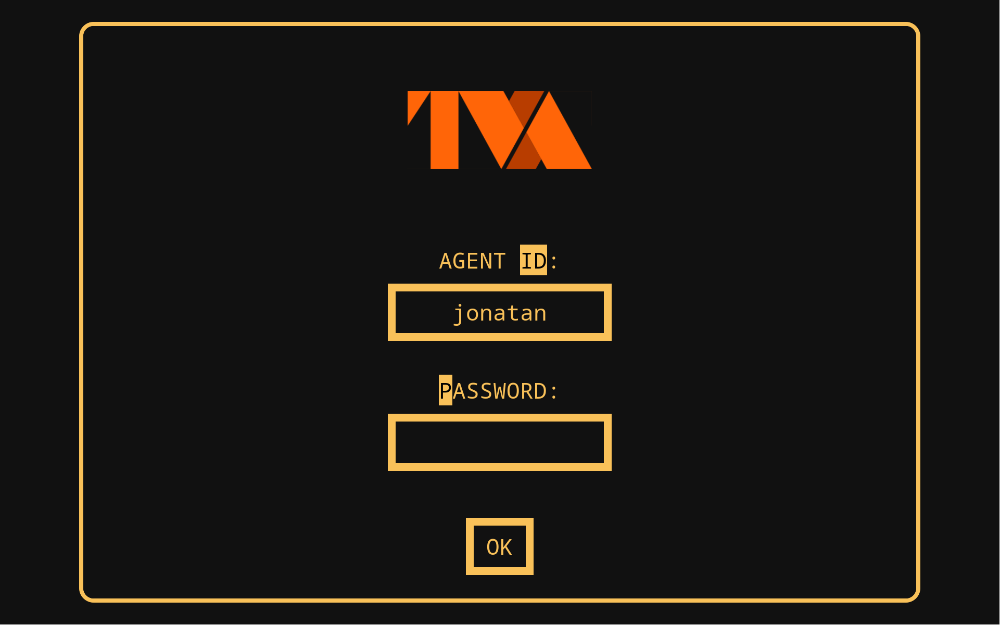
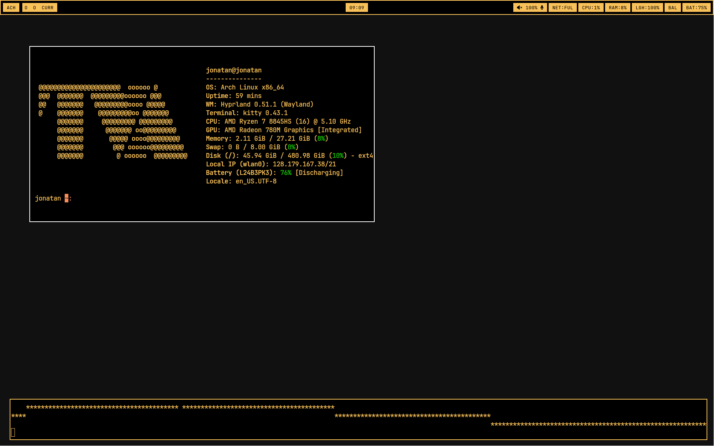

# Arch Linux x Hyprland dotfiles  

  
My arch linux rices 
- miata
- tva (from loki/deadpool and wolverine)

## About

The dotfiles behind my laptop configuration. This is a work in progress :)

## Screenshots

| type | TVA | Miata |
| ---- | --- | ----- |
| lock |  | coming soon |
| home |  | coming soon |

## Using

### Keybinds

Keybinds currently depend on the dots variant

- ``SUPER + D`` : start menu (wofi drun)
- ``SUPER + S`` : power menu (wofi dmenu)
- ``SUPER + Q`` : terminal (kitty by default)
- ``SUPER + E`` : file explorer (dolphin by default)
- ``SUPER + C`` : close the focused window

- ``SUPER + N`` : open nmtui

- ``SUPER + R`` : resize a window
- ``SUPER + V`` : toggle window float
- ``SUPER + <arrowkey>`` : focus a window (vim keybinds on tva)
- ``SUPER + SHIFT + <arrowkey>`` : move a window (vim keybinds on tva)

- ``SUPER + SHIFT + S`` : take a regional screenshot

- ``COPILOT KEY`` : open [CatGPT](https://github.com/woutervdijke/catgpt) (disabled)

## Install

You need the following modules
Hyprland : ``hyprland hyprshot hyprlock hyprcursor hyprpaper hyprpicker waybar``  
Other apps (can be changed) ``firefox kitty dolphin wofi networkmanager pavucontrol nmtui kdeconnect``

You can install these using ``sudo pacman -S`` (or using your favorite package manager)

To install the dotfiles, clone the repo
```git clone https://github.com/PadjokeJ/dotfiles.git```
Then cd into the new folder
```cd dotfiles```
Then move files into their respective folders. To simplify this step I have made bash scripts
- miata theme : ``./installmiot.sh``
- tva theme : ``./installtva.sh``
